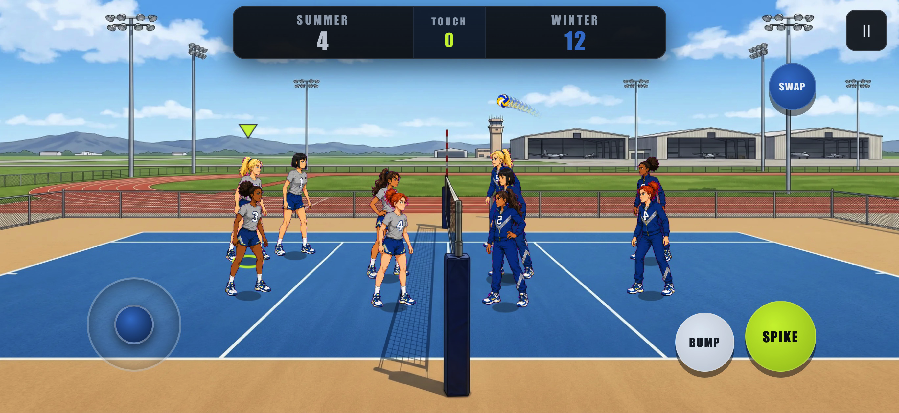

# PT Volleyball

An offline 5-on-5 arcade volleyball game with an Air Force PT-inspired theme, desktop keyboard play, mobile touch controls, and polished original art.

[Play PT Volleyball](https://vibezzzcoder.github.io/pt-volleyball/)

## Status

The current open-source build is fully playable on desktop and mobile. It supports solo play against the CPU, two players on one shared keyboard, two courts, selectable match lengths, and three solo difficulty levels. Future updates may add more characters, courts, and animation, but the current core game is complete and fun to play.

## Screenshots

## Features

- Arcade 5-on-5 volleyball between Summer and Winter PT squads
- `1 Player` mode against CPU
- `2 Players` mode on a shared keyboard
- Two courts: Base Gym and The Track
- Selectable player character
- Polished character, ball, and court art
- Mobile touch controls for phone and tablet browsers
- A self-contained release that plays offline with no network dependencies

## Difficulty (1 Player)

- **Easy** — your CPU teammates reliably keep every ball that's hit into their zone alive. The only ball that's yours to win or lose is the one that comes to *you*; the opponent plays loose and is beatable.
- **Medium** — a balanced, side-to-side game where both teams trade long rallies.
- **Hard** — the CPU opponent digs your attacks and answers with fast, accurate, deliberate spikes. Your AI teammates are only competent, so you have to carry.

In **2 Players** mode the CPU teammates focus on *passing* — they set the ball up for the human players and leave the scoring to you, rather than putting the ball away themselves.

Across all modes the CPU follows real volleyball rules: it won't contact the ball twice in a row, and a side gets at most three touches before it must go over the net.

Choose a Short (11), Medium (21), or Long (25) match. A team must win by two.

## Controls

Player 1:

- `W` / `A` / `S` / `D` = move
- `F` = bump (while moving with no ball in reach = diving dig; in the air = tip)
- `G` = spike (at the net with no ball to attack = block; jump early and hold = Super Spike)
- `R` = swap player

Player 2:

- `Arrow keys` = move
- `,` = bump (also dives when moving, tips in the air)
- `.` = spike (also blocks at the net, charges when held)
- `/` = swap player

System:

- `Esc` / `P` = pause

Bump and Spike are context-sensitive — the same two inputs cover every verb, so
there is nothing extra to learn or reach for:

- **Dive** — bump while on the move. Buys extended reach for a moment, then you
  have to scramble back to your feet.
- **Tip** — bump while airborne at the net. Drops the ball into the gap behind
  the block instead of hammering it.
- **Block** — spike at the net with no ball to attack. Jumps and presents a real
  contact volume above the net, marked on the tape so attackers can aim around it.
- **Super Spike** — jump early and keep Spike held. The attack fires by itself
  when the ball arrives, and only a charged attack turns the ball lime.
- **Quick attack** — hit the ball while it is still rising, before the set peaks.
- **Serve** — hold Bump or Spike to charge, steer with movement to aim, release to
  serve. A tap serves exactly as it always did, and the auto-serve still fires if
  you do nothing.

Contacts are graded on timing: meeting the ball cleanly reads **NICE** or
**PERFECT** and hits harder, while a mistimed contact goes soft and wandering —
weak, but never a dead ball.

Assists (on the mode screen):

- **Landing Marker** (on by default) — a single ring showing where the incoming
  ball will land.
- **Auto Switch** (off by default) — hands control to whichever teammate is about
  to play the ball. Manual swap stays the default.

Mobile:

- Touch controls appear automatically; the on-screen BUMP / SPIKE buttons do the
  same context-sensitive dive / tip / block, and hold the same way to charge.
- Portrait and landscape are both playable.

## Offline Play

Download `release/upload/index.html` and open it in a browser. That single file contains the complete game and art, so it needs no installation, server, or network connection.

## Attribution

Created by [@VibezZzCoder](https://github.com/VibezZzCoder).

PT Volleyball is an independent fan/prototype project and is not an official U.S. Air Force product. It is not endorsed by, sponsored by, or affiliated with the U.S. Air Force, the Department of the Air Force, or the U.S. Department of Defense.

The project uses fictionalized, stylized, military-inspired athletic characters and settings. No official endorsement is implied.

## License

PT Volleyball is licensed under the GNU General Public License v3.0 or later.

Copyright (C) 2026 VibezZzCoder and PT Volleyball contributors

This project is open-source free software, not proprietary software. You can redistribute it and/or modify it under the terms of the GNU General Public License as published by the Free Software Foundation, either version 3 of the License, or, at your option, any later version.

This project is distributed in the hope that it will be useful, but WITHOUT ANY WARRANTY; without even the implied warranty of MERCHANTABILITY or FITNESS FOR A PARTICULAR PURPOSE. See the GNU General Public License for more details.

The license applies to this project's original code and assets. It does not grant rights to use any third-party trademarks, logos, seals, emblems, or official marks.

The copyright notice applies to this independent fan/prototype project's original code and original assets only, including future contributor work where applicable. It does not claim ownership of, endorsement by, or affiliation with the U.S. Air Force, the Department of the Air Force, or the U.S. Department of Defense.

See `LICENSE` for the full license text.
