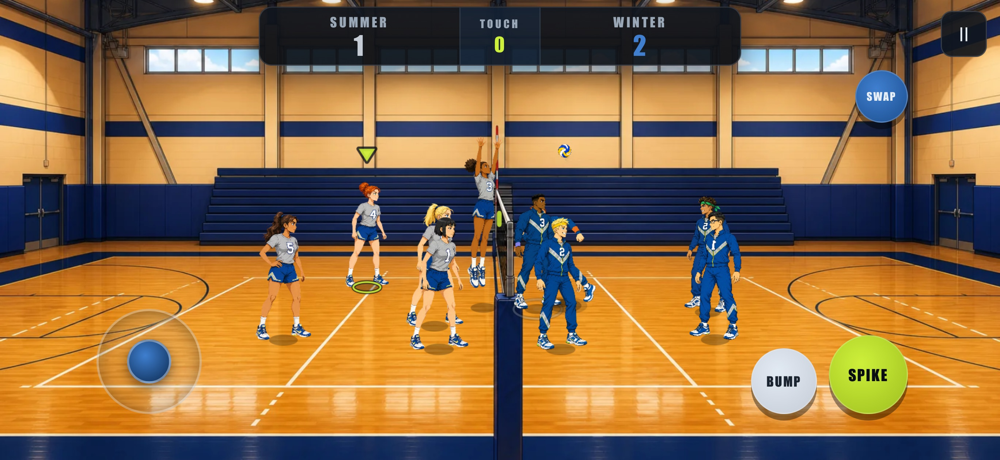
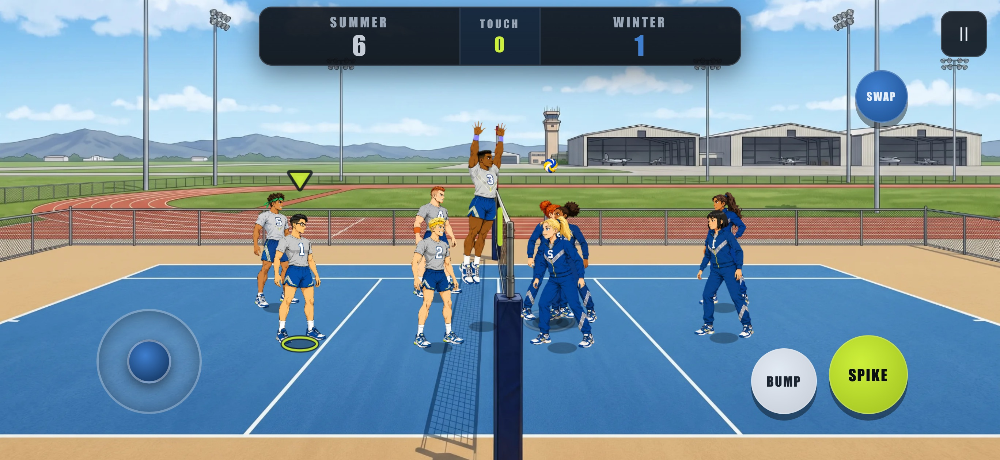
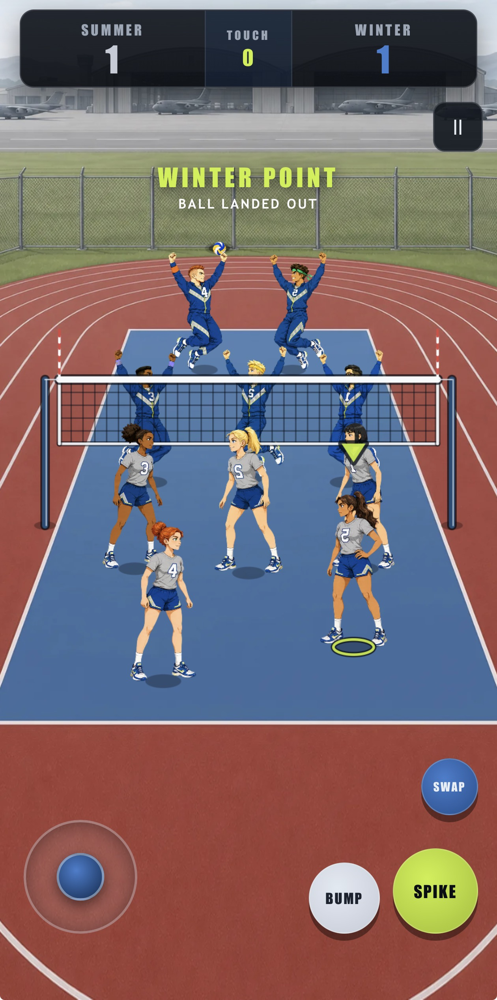

# PT Volleyball

A single-file offline browser volleyball game prototype with an Air Force PT theme, desktop keyboard play, mobile touch controls, and embedded generated art.

Play it here:

https://vibezzzcoder.github.io/pt-volleyball/

## Status

This is an early prototype. Gameplay, art, controls, and balance may change frequently.

## Screenshots

## Features

- Arcade 5-on-5 volleyball between Summer and Winter PT squads
- `1 Player` mode against CPU
- `2 Players` mode on a shared keyboard
- Selectable court presentation
- Selectable player character
- Embedded self-contained generated character, ball, and environment art
- Mobile touch controls for phone and tablet browsers
- Offline play from a single `index.html` file with no network dependencies

## Controls

Player 1:

- `W` / `A` / `S` / `D` = move
- `F` = bump (press while moving with no ball in reach = diving dig)
- `G` = spike (press near the net with no ball to attack = defensive block jump)
- `R` = swap player

Player 2:

- `Arrow keys` = move
- `,` = bump (also dives when moving)
- `.` = spike (also blocks at the net)
- `/` = swap player

System:

- `Esc` / `P` = pause

Bump and Spike are context-sensitive: the same input becomes a **dive** (bump while on the move) or a **block** (spike at the net when there's no ball to attack), so you always get a visible reaction.

Mobile:

- Touch controls appear automatically; the on-screen BUMP / SPIKE buttons do the same context-sensitive dive / block.
- Portrait and landscape are both playable.

## Local Play

Open `index.html` directly in a desktop browser, or host the folder with any static file server.

No build step is required for local play.

## Attribution

Created by [@VibezZzCoder](https://github.com/VibezZzCoder).

PT Volleyball is an independent fan/prototype project and is not an official U.S. Air Force product. It is not endorsed by, sponsored by, or affiliated with the U.S. Air Force, the Department of the Air Force, or the U.S. Department of Defense.

The project uses fictionalized, stylized, military-inspired athletic characters and settings. No official endorsement is implied.

## Contributing

Issues, suggestions, and pull requests are welcome. Please keep contributions respectful and consistent with the project's fictional, unofficial nature.

## License

PT Volleyball is licensed under the GNU General Public License v3.0 or later.

Copyright (C) 2026 VibezZzCoder and PT Volleyball contributors

This project is open-source free software, not proprietary software. You can redistribute it and/or modify it under the terms of the GNU General Public License as published by the Free Software Foundation, either version 3 of the License, or, at your option, any later version.

This project is distributed in the hope that it will be useful, but WITHOUT ANY WARRANTY; without even the implied warranty of MERCHANTABILITY or FITNESS FOR A PARTICULAR PURPOSE. See the GNU General Public License for more details.

The license applies to this project's original code and assets. It does not grant rights to use any third-party trademarks, logos, seals, emblems, or official marks.

The copyright notice applies to this independent fan/prototype project's original code and original assets only, including future contributor work where applicable. It does not claim ownership of, endorsement by, or affiliation with the U.S. Air Force, the Department of the Air Force, or the U.S. Department of Defense.

See `LICENSE` for the full license text.
